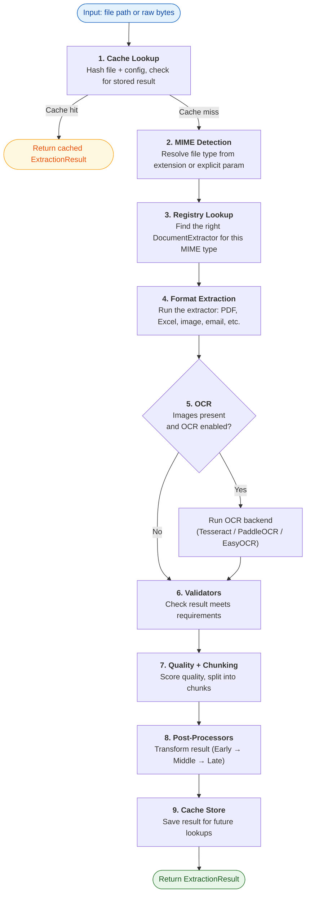
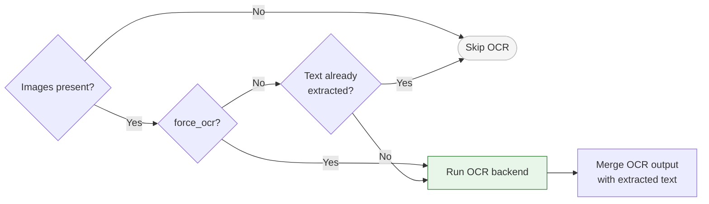

# Extraction Pipeline

Every file Kreuzberg processes follows the same multi-stage pipeline. A PDF, a scanned image, a spreadsheet, an email attachment: they all enter at the top and come out as a structured `ExtractionResult` at the bottom. The stages run in a fixed order, but several of them are conditional. Caching can short-circuit the entire flow. OCR only runs when images are present. Post-processing steps only fire if you've configured them.

This page walks through each stage in detail so you understand what happens to your file, when, and why.

---

## How the Pipeline Works



The diagram above shows every stage in sequence. Let's break each one down.

---

## 1. Cache Lookup

When caching is enabled (`cache=True` in your `ExtractionConfig`), the pipeline starts by computing a hash from the file's content and your configuration. If a result with that exact hash already exists in the cache, it's returned immediately. No extraction, no OCR, no post-processing. The entire pipeline is skipped.

This is significant for workloads that reprocess the same files. Repeated extractions of the same document go from hundreds of milliseconds to single-digit milliseconds.

Cache keys are content-based, not path-based. If you rename a file but the bytes are identical, the cache still hits. If you change your config (switch OCR backends, adjust chunking), a new cache key is generated so stale results are never returned.

---

## 2. MIME Detection

Before Kreuzberg can extract anything, it needs to know what format the file is. It resolves the MIME type through one of two paths:

- **Explicit:** You pass `mime_type="application/pdf"` and Kreuzberg validates it against the list of supported types.
- **Auto-detection:** Kreuzberg reads the file extension (for example, `.pdf` → `application/pdf`) from an internal mapping table.

If the resolved MIME type isn't in the supported list, the pipeline stops immediately with an `UnsupportedFormat` error. No compute is wasted on files Kreuzberg can't handle.

For the full details on how extension mapping, normalization, and validation work, see [Format Support](../reference/formats.md).

---

## 3. Registry Lookup

With the MIME type resolved, Kreuzberg queries the extractor registry to find the `DocumentExtractor` that handles this format. The registry is a map from MIME types to extractor implementations, managed by the [plugin system](plugin-system.md).

If multiple extractors are registered for the same MIME type (for example, you registered a custom PDF extractor alongside the built-in one), the one with the higher `priority()` value is selected. All built-in extractors have a priority of 0, so any custom extractor with a priority above 0 takes precedence.

```rust title="registry_lookup.rs"
let registry = get_document_extractor_registry();
let extractor = registry.get("application/pdf")?;
```

---

## 4. Format Extraction

This is the core of the pipeline. The selected extractor reads the file and produces an `ExtractionResult` containing the extracted text, metadata (author, title, creation date), page count, and detected language.

Each file format has a tailored extraction strategy:

| Format                             | What happens                                                                                                                                                                                           |
| ---------------------------------- | ------------------------------------------------------------------------------------------------------------------------------------------------------------------------------------------------------ |
| **PDF**                            | Text is extracted directly from the PDF text layer using pdf_oxide (pure Rust). If the PDF contains embedded images (scanned pages, diagrams), those images are collected and passed to the OCR stage. |
| **Excel / Spreadsheets**           | Each sheet is parsed individually using calamine. Cell values are assembled into structured Markdown tables, preserving column alignment.                                                              |
| **Images** (JPEG, PNG, TIFF, etc.) | The image bytes are loaded into memory and forwarded directly to the OCR backend. There is no text layer to extract from an image.                                                                     |
| **XML / Plain text**               | A streaming parser processes the file incrementally. This keeps memory usage constant even for multi-gigabyte files because the entire file is never loaded at once.                                   |
| **Email** (`.eml`, `.msg`)         | The MIME structure is parsed. The email body (plain text or HTML) is extracted as the main content. Attachments are extracted recursively using the same pipeline.                                     |
| **Office** (DOCX, PPTX)            | The file is a ZIP archive containing XML. Kreuzberg opens the archive, locates the content XML parts, and parses the document structure into text.                                                     |

The extraction result at this point contains raw extracted text. It hasn't been validated, scored, or chunked yet.

---

## 5. OCR (Conditional)

OCR runs only when two conditions are true: the file contains images (or is an image itself), and OCR is enabled in the configuration. Even when both conditions are met, Kreuzberg applies a third check: if the format extractor already produced text, OCR is skipped. This avoids redundant processing on PDFs that have a searchable text layer.

You can override this behavior with `force_ocr=True`, which tells Kreuzberg to always run OCR regardless of whether text was already extracted. This is useful for PDFs where the text layer is unreliable or incomplete.

Conversely, `disable_ocr=True` skips OCR entirely. Image files that would normally require OCR return empty content instead of raising a `MissingDependencyError`. This is useful when you want to extract text from non-image formats only and avoid OCR overhead or dependency requirements.



Kreuzberg ships three OCR backends:

| Backend       | Engine               | When to use it                                                                                                               |
| ------------- | -------------------- | ---------------------------------------------------------------------------------------------------------------------------- |
| **Tesseract** | Native Rust bindings | Default. Fast, solid accuracy for Latin scripts. Good general-purpose choice.                                                |
| **PaddleOCR** | ONNX Runtime         | Best accuracy for Chinese, Japanese, Korean (CJK) scripts. Runs natively without Python.                                     |
| **EasyOCR**   | Python + PyTorch     | Supports 80+ languages including Arabic, Hindi, Thai, and other complex scripts. Only available through the Python bindings. |

When OCR completes, the OCR output is merged with any text the format extractor already produced. The merged result moves to post-processing.

---

## 6. Validators

Validators are the first post-processing step. They inspect the `ExtractionResult` and decide whether it meets your requirements. If a validator rejects the result, the pipeline stops immediately and the error is returned to the caller. No further processing happens.

This is intentionally strict. Validators exist to catch results that are fundamentally wrong (empty text, garbled output, suspiciously short content) before downstream systems consume them.

```python title="example_validator.py"
class MinLengthValidator:
    def validate(self, result, config):
        if len(result.content) < 100:
            raise ValidationError("Extracted text too short")
```

You register validators through the plugin system. See [Plugin System](plugin-system.md) for details.

---

## 7. Quality Scoring + Chunking

These two steps run after validation.

**Quality scoring** is optional. When `enable_quality_processing=True`, Kreuzberg analyzes the extracted text and assigns a numeric score between 0.0 and 1.0. The score factors in the ratio of alphabetic characters to non-text characters, word frequency distribution (gibberish scores low), and the presence of formatting artifacts like repeated whitespace or encoding errors. The result is stored in `result.quality_score`.

**Chunking** is also optional. When you provide a `ChunkingConfig`, the extracted text is split into overlapping fragments with configurable maximum size and overlap. Each chunk records its start and end offset relative to the original text.

```python title="chunking_config.py"
config = ExtractionConfig(
    chunking=ChunkingConfig(max_chars=1000, max_overlap=100)
)
# result.chunks → list of Chunk objects with .text, .start_offset, .end_offset
```

Chunking is designed for RAG (Retrieval-Augmented Generation) pipelines. The overlap ensures that context at chunk boundaries isn't lost when chunks are embedded and retrieved independently.

---

## 8. Post-Processors

Post-processors are the final transformation step. They receive the `ExtractionResult` and can modify it in any way: clean up text, extract entities, redact sensitive content, reformat output, or add custom metadata.

Post-processors run in three ordered stages so you can control what happens first:

| Stage      | Purpose               | Examples                                                            |
| ---------- | --------------------- | ------------------------------------------------------------------- |
| **Early**  | Raw text cleanup      | Strip control characters, fix encoding issues, normalize whitespace |
| **Middle** | Content analysis      | Extract named entities, detect language, classify document type     |
| **Late**   | Final transformations | Apply output formatting, generate summaries, redact PII             |

An important design choice: **post-processor errors do not fail the extraction.** If a post-processor throws an exception, the error is logged and the pipeline continues with the result as-is. This means a buggy post-processor can't take down your extraction pipeline.

---

## 9. Cache Store + Return

If caching is enabled and the extraction completed without errors, the result is written to the cache for future lookups.

The final `ExtractionResult` returned to you contains:

- **`content`** - the fully processed text
- **`metadata`** — format-specific metadata (author, title, creation date, page count, etc.)
- **`chunks`** — optional list of text chunks with offsets (if chunking was configured)
- **`quality_score`** — optional quality assessment (if quality processing was enabled)
- **Processing history** — a trace of which stages ran, useful for debugging

---

## Error Handling Strategy

The pipeline follows a deliberate error strategy: fail early for things the developer can fix, be resilient for things that are beyond their control.

| Stage             | Error type                                                | What happens                                                                         |
| ----------------- | --------------------------------------------------------- | ------------------------------------------------------------------------------------ |
| MIME detection    | `UnsupportedFormat`                                       | Pipeline stops. The file type isn't supported.                                       |
| Format extraction | `ParsingError`                                            | Pipeline stops. The file is corrupt or the format couldn't be parsed.                |
| Validators        | `ValidationError`                                         | Pipeline stops. The result didn't meet your defined requirements.                    |
| Post-processors   | Non-fatal processor error                                 | Error is logged. Pipeline continues. Result is returned without that transformation. |
| System            | I/O failure, out-of-memory, or other system-level failure | Always propagated. These indicate infrastructure problems.                           |

For the complete error taxonomy, see [Error Handling](../reference/errors.md).

---

## Built-in Optimizations

The pipeline includes several optimizations that run automatically without configuration:

- **Cache short-circuits** bypass every processing stage when a cached result exists
- **Lazy OCR** avoids redundant OCR when the format extractor already produced usable text
- **Streaming parsers** process XML, text, and archive files incrementally with constant memory
- **Parallel batching** with `batch_extract_file` distributes files across all CPU cores via Tokio
- **Shared async runtime** reuses a single Tokio runtime across calls, avoiding repeated initialization

---

## What to Read Next

- [Architecture](architecture.md) — how the system is designed
- [Plugin System](plugin-system.md) — building custom extractors, OCR backends, and processors
- [Format Support](../reference/formats.md) — how file types are identified
- [Configuration Guide](../guides/configuration.md) — tuning the pipeline
- [OCR Guide](../guides/ocr.md) — configuring OCR backends
