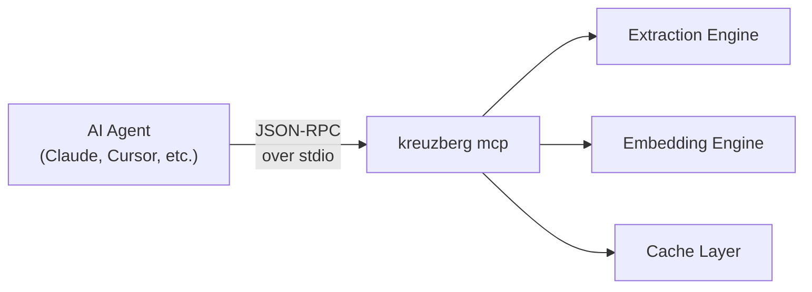

# MCP Integration <span class="version-badge">v4.0.0</span>

Kreuzberg speaks [Model Context Protocol](https://modelcontextprotocol.io/). That means any AI agent — Claude, Cursor, a custom LangChain pipeline — can extract documents, generate embeddings, and manage caches through a standard tool interface without writing extraction code.

Two commands to get started:

```bash title="Terminal"
pip install "kreuzberg[all]"
kreuzberg mcp
```

That's it. You now have an MCP server running over stdio, ready for any compatible client.

---

## How It Works

The MCP server wraps Kreuzberg's full extraction engine behind 13 tools that agents can discover and call. It runs as a child process, communicating over stdin/stdout with JSON-RPC messages. No HTTP ports, no network configuration — the agent spawns it and talks to it directly.



---

## Server Modes

### Stdio (Default)

The standard mode for local AI tools. The agent spawns `kreuzberg mcp` as a subprocess and communicates over pipes.

```bash title="Terminal"
kreuzberg mcp
kreuzberg mcp --config kreuzberg.toml
```

This is what Claude Desktop, Cursor, and most MCP clients expect.

### HTTP Transport

!!! Info "Feature flag: `mcp-http`" HTTP transport requires the `mcp-http` feature flag at build time.

For remote deployments or multi-client setups where stdio doesn't work — shared servers, team environments, cloud-hosted agents — HTTP transport exposes the same tool interface over the network.

---

## Tools

Every tool is discoverable at runtime via `list_tools`. Here's the full surface:

| Tool                  | Params                    | What it does                                                                 |
| --------------------- | ------------------------- | ---------------------------------------------------------------------------- |
| `extract_file`        | `path`                    | Extract text and metadata from a local file                                  |
| `extract_bytes`       | `data` (base64)           | Extract from base64-encoded file content                                     |
| `batch_extract_files` | `paths`                   | Extract multiple files in one call                                           |
| `detect_mime_type`    | `path`                    | Identify a file's format                                                     |
| `list_formats`        | —                         | All supported formats <span class="version-badge">v4.5.2</span>              |
| `get_version`         | —                         | Library version string <span class="version-badge">v4.5.2</span>             |
| `embed_text`          | `texts`                   | Generate embedding vectors <span class="version-badge">v4.5.2</span>         |
| `chunk_text`          | `text`                    | Split text into overlapping chunks <span class="version-badge">v4.5.2</span> |
| `cache_stats`         | —                         | How much is cached                                                           |
| `cache_clear`         | —                         | Evict all cached results                                                     |
| `cache_manifest`      | —                         | Model checksums <span class="version-badge">v4.5.2</span>                    |
| `cache_warm`          | —                         | Pre-download models <span class="version-badge">v4.5.2</span>                |
| `extract_structured`  | `path`, `schema`, `model` | Extract structured JSON via LLM <span class="version-badge">v4.8.0</span>    |

All extraction tools accept an optional `config` object — the same `ExtractionConfig` shape used in the Python API. `extract_structured` requires the server to be built with the `liter-llm` feature.

---

## Connecting AI Tools

### Claude Desktop

Add to `~/Library/Application Support/Claude/claude_desktop_config.json`:

```json title="claude_desktop_config.json"
{
  "mcpServers": {
    "kreuzberg": {
      "command": "kreuzberg",
      "args": ["mcp"]
    }
  }
}
```

Restart Claude. Kreuzberg's tools appear automatically — ask Claude to "extract text from invoice.pdf" and it will call `extract_file` behind the scenes.

### Cursor

Add to `.cursor/mcp.json` in your project root:

```json title=".cursor/mcp.json"
{
  "mcpServers": {
    "kreuzberg": {
      "command": "kreuzberg",
      "args": ["mcp"]
    }
  }
}
```

### Python MCP Client

For building custom agent pipelines, use the official `mcp` Python SDK:

```python title="mcp_client.py"
import asyncio
from mcp import ClientSession, StdioServerParameters
from mcp.client.stdio import stdio_client

async def main() -> None:
    server_params = StdioServerParameters(
        command="kreuzberg", args=["mcp"]
    )

    async with stdio_client(server_params) as (read, write):
        async with ClientSession(read, write) as session:
            await session.initialize()

            tools = await session.list_tools()
            print(f"Available: {[t.name for t in tools.tools]}")

            result = await session.call_tool(
                "extract_file",
                arguments={"path": "document.pdf"},
            )
            print(result)

asyncio.run(main())
```

### Spawning from Python

If your application manages the server lifecycle directly:

```python title="spawn_server.py"
import subprocess

process = subprocess.Popen(
    ["python", "-m", "kreuzberg", "mcp"],
    stdout=subprocess.PIPE,
    stderr=subprocess.PIPE,
)
print(f"MCP server running (PID {process.pid})")
```

---

## Configuration

A config file sets extraction defaults for every tool call:

```bash title="Terminal"
kreuzberg mcp --config kreuzberg.toml
```

```toml title="kreuzberg.toml"
[ocr]
backend = "tesseract"
language = "eng"

[chunking]
max_chars = 1000
max_overlap = 100
```

Individual tool calls can still override these defaults — pass a `config` object in the tool arguments and it takes precedence over the file.

---

## Running in Docker

```bash title="Terminal"
docker run ghcr.io/kreuzberg-dev/kreuzberg:latest mcp

docker run \
  -v $(pwd)/kreuzberg.toml:/config/kreuzberg.toml \
  ghcr.io/kreuzberg-dev/kreuzberg:latest \
  mcp --config /config/kreuzberg.toml
```

For production, use Compose with a persistent cache volume so embedding models don't re-download on restart:

```yaml title="docker-compose.yaml"
services:
  kreuzberg-mcp:
    image: ghcr.io/kreuzberg-dev/kreuzberg:latest
    command: mcp --config /config/kreuzberg.toml
    volumes:
      - ./kreuzberg.toml:/config/kreuzberg.toml:ro
      - cache-data:/app/.kreuzberg
    restart: unless-stopped

volumes:
  cache-data:
```

---

## What to Read Next

- [API Server Guide](api-server.md) — the HTTP REST API and detailed MCP tool reference
- [Docker Deployment](docker.md) — container setup for all server modes
- [Configuration Reference](../reference/configuration.md) — every config option explained
