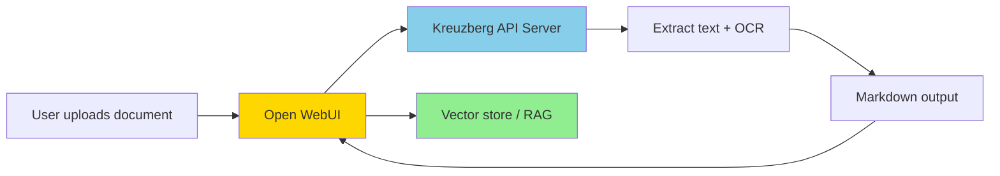

# Open WebUI


Kreuzberg can serve as the **Content Extraction Engine** for [Open WebUI](https://openwebui.com), replacing docling-serve or other extraction backends. When users upload documents in Open WebUI, Kreuzberg extracts the text — supporting 91+ document formats and 248 programming languages — including PDFs, Office documents, images with OCR, and source code — without requiring a GPU.

## How it works



1. A user uploads a document in Open WebUI.
2. Open WebUI sends the file to Kreuzberg's API server.
3. Kreuzberg extracts the content (with OCR for images/scanned PDFs) and returns markdown.
4. Open WebUI stores the text in its vector database for retrieval-augmented generation.

## Supported engine modes

Kreuzberg implements two Open WebUI-compatible endpoints. Choose either mode:

### Docling engine (recommended)

Kreuzberg implements the docling-serve API at `POST /v1/convert/file`, acting as a drop-in replacement.

| Setting | Value |
|---|---|
| `CONTENT_EXTRACTION_ENGINE` | `docling` |
| `DOCLING_SERVER_URL` | `http://kreuzberg:8000` |

### External engine

Kreuzberg also implements the generic external document loader API at `PUT /process`.

| Setting | Value |
|---|---|
| `CONTENT_EXTRACTION_ENGINE` | `external` |
| `EXTERNAL_DOCUMENT_LOADER_URL` | `http://kreuzberg:8000` |

Both modes can also be configured via the Open WebUI Admin UI at **Settings > Documents > Content Extraction Engine**.

## Quick start with Docker Compose

```yaml
services:
  kreuzberg:
    image: ghcr.io/kreuzberg-dev/kreuzberg:latest-core
    ports:
      - "8000:8000"
    command: ["serve", "--host", "0.0.0.0", "--port", "8000"]
    healthcheck:
      test: ["CMD", "kreuzberg", "version"]
      interval: 10s
      timeout: 5s
      retries: 5

  open-webui:
    image: ghcr.io/open-webui/open-webui:main
    ports:
      - "3000:8080"
    environment:
      CONTENT_EXTRACTION_ENGINE: "docling"
      DOCLING_SERVER_URL: "http://kreuzberg:8000"
    depends_on:
      kreuzberg:
        condition: service_healthy
```

```bash
docker compose up
```

Open <http://localhost:3000> and upload a document. Kreuzberg handles the extraction.

## Running Kreuzberg standalone

If Open WebUI is already running, you only need Kreuzberg:

=== "Docker"

    ```bash
    docker run -p 8000:8000 ghcr.io/kreuzberg-dev/kreuzberg:latest-core \
      serve --host 0.0.0.0 --port 8000
    ```

=== "CLI (cargo/brew)"

    ```bash
    kreuzberg serve --host 0.0.0.0 --port 8000
    ```

Then point Open WebUI to `http://<kreuzberg-host>:8000` using either engine mode.

## Verifying the integration

Test the endpoints directly:

=== "Docling endpoint"

    ```bash
    curl -F "files=@document.pdf" http://localhost:8000/v1/convert/file
    ```

    Expected response:

    ```json
    {
      "document": {
        "md_content": "# Extracted content..."
      },
      "status": "success"
    }
    ```

=== "External endpoint"

    ```bash
    curl -X PUT \
      -H "Content-Type: application/pdf" \
      -H "X-Filename: document.pdf" \
      --data-binary @document.pdf \
      http://localhost:8000/process
    ```

    Expected response:

    ```json
    {
      "page_content": "# Extracted content...",
      "metadata": {
        "source": "document.pdf"
      }
    }
    ```

## Supported formats

Kreuzberg supports 91+ file formats and 248 programming languages — including PDF, DOCX, PPTX, XLSX, images (PNG, JPG, TIFF with OCR), HTML, Markdown, email (EML, MSG), archives (ZIP, TAR), ebooks (EPUB), source code, and more. See the [full format list](../reference/formats.md).
